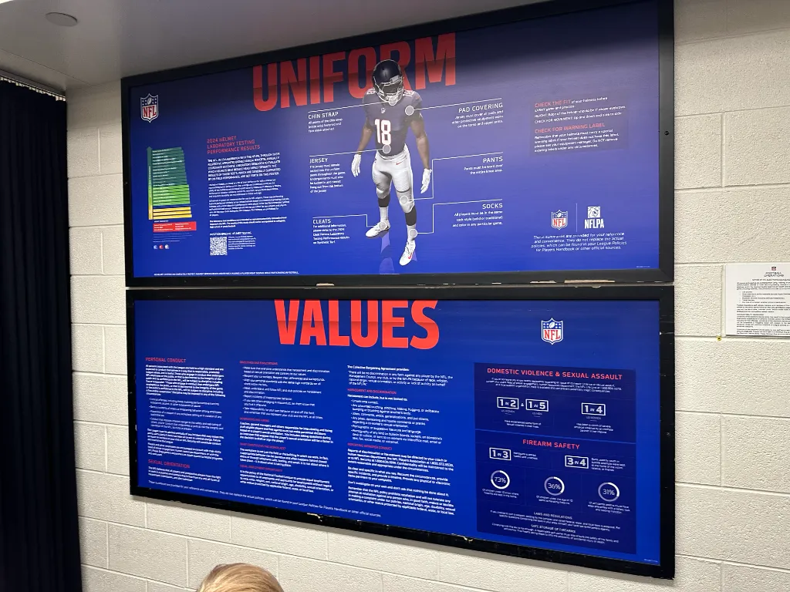

Photos from this experience are [available on Flickr](https://www.flickr.com/photos/chris-short/albums/72177720323541265/)



We did something beyond cool this weekend. Friends invited us to a flag football tournament at Ford Field to raise money for the [Crohn's and Colitis Foundation](https://www.crohnscolitisfoundation.org/). The dad volunteers for several non-profit organizations, and the family's twins are in Max's class. We were invited to join them at Ford Field as their guests for the VIP experience.

We had no idea what was in store for us; all we kept telling Max was, "This is a once-in-a-lifetime opportunity." Upon arrival, we signed waivers and booked time to go on a tour of Ford Field. We spent the better part of three hours on the Detroit Lions turf. A non-playing area between the fields allowed us to play on the field between the 40-yard lines. Julie, Max, and I played catch with Max's friends at the 50-yard line. We played catch in different places on the field, including both end zones. Before the tournament started its last batch of games, there was a kid's run from the 50 down to the end zone and back, as well as field goal-kicking.

After playing hard on the field, we had lunch. Then we went on our Ford Field tour. We learned a lot about Ford Field and its history. There's an office building inside Ford Field that the Detroit Lions now lease, but wow, that would have been a fantastic place to work. The basement we walked through used to be a storage area for Macy's. We discussed that the Lions' recent increase in wins and popularity requires more staff and space for them to work.

We walked through the visitors' locker room and saw the league's bare minimum standards for visitor locker rooms. One thing in the visitor's locker room that wasn't in the Lions' locker was the locks on the lockers. The tour guide explained that Detroit's outmoded negative perception worldwide extended into Ford Field's basement and the visitor's locker room. Despite all the security and cameras on a gameday, it didn't put visiting players' minds at ease. They requested locks because they were in Detroit. This perception is a false narrative about Detroit, as I've been telling folks since 2017.

After that, we popped over to the Lions locker room. It was spacious, with some cool features, but it didn't feel like a locker room since none of the players' gear was being stored there. The Lions practice facility is in Allen Park. The tour guide explained that the equipment crew ferries gear from Allen Park to downtown Detroit and back for games because maintaining the ever-changing gear in both places made no fiscal sense.

The Lions locker room was ringed by Honolulu blue LEDs, Lions legend's names, the team's logo when they played, and the years they played. The Detroit Lions logo on the floor in the center of the room is roped off to visitors because only coaches and players can walk on it. I kneeled and explained to Max that Lions head coach Dan Campbell had done the post-game talks with the team and that the HC awarded players game balls here. We watched many of these videos during the 2024 NFL season. Max went from "Where are we?" to gobsmacked when he realized where he was. After that, we went to the 7th floor and toured the 262-person press box. The press box is way up in the stadium and very long. Julie went to the bottom of the press box and looked down at the stadium seats below. She said she started getting a little dizzy (it appeared the press box was on an overhang)

This was indeed a fantastic experience that I hope we never forget. I cannot believe the amount of access we had to the field, including end zones, between games. Seeing Dan Campbell's office made us laugh because one of Max's uncles is named Dan Campbell (we always have him make reservations or order food for pickup at family gatherings). We had so much fun. The foundation raised over $200K during the event. Not only did we have fun, but the foundation also did well.
