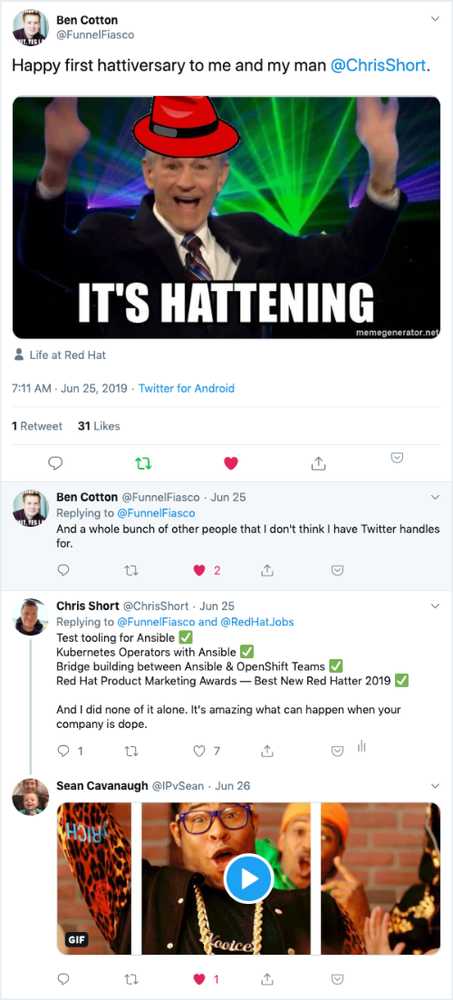

+++
author = "Chris Short"
categories = ["Kubernetes", "Life"]
date = 2019-08-18T07:00:00Z
description = ""
draft = false
tags = ["OpenShift", "Red Hat", "Kubernetes"]
title = "Joining forces with OpenShift"
image = "/joining-forces-with-openshift/ansible-to-openshift.png"

+++

This Monday (2019-08-19) will be my first day as Principal Technical Marketing Manager on the Cloud Platforms team at Red Hat. What does that mean? [OpenShift](https://www.openshift.com/) (a lot of OpenShift), Kubernetes, containers, Operators, and all the associated bits will be my day job. Helping folks help themselves with technology is still and always will be the name of my game. But, working full time in the Kubernetes or cloud native ecosystem was a 2020 goal. Crossing off 2020 goals in 2019. #winning

## Wait... There's still work to do

My involvement with Ansible won't end. Oh, heavens, no! I am still involved in AnsibleFest (see you in Atlanta).  Part of my charge when joining Red Hat was to encourage more collaboration between the Ansible and OpenShift teams. That has been happening and will continue to happen with me sitting on the OpenShift side. I'm also acting as an Ansible insider for folks on the Cloud Platforms team. I've been told to be ready for a challenge and I'm looking forward to it.



When I announced I was joining the Ansible team, I wrote, "[I'd like to work to see what Ansible can bring to CNCF projects.](https://chrisshort.net/joining-ansible-team-at-red-hat/?utm_source=devopsish&utm_medium=newsletter&utm_campaign=141)" You can write Kubernetes Operators with Ansible. Also, Ansible Operators are now a priority. Let's face it; *more people know how to write Ansible than Go*. [Ansible Operators](https://ansible.com/operators/?utm_source=devopsish&utm_medium=newsletter&utm_campaign=141&utm_term=kubernetes) are something I hope I can hang my hat on some day. But, there is much work to be done still. Ansible's future lies in its ability to be picked up and used capably by almost everyone in the IT department. The more that thinking can be brought to the cloud native ecosystem, the better.

## Burnout

Last month, [I wrote about burnout in DevOps'ish](https://devopsish.com/137/), "Values mismatch is something I am struggling with right now in my own position. I highly value working in the Kubernetes community. One of my personal goals is to work full time on Kubernetes (or closer to the core of it). However, my job on the Ansible team doesn’t directly benefit from this work. It does feel like I’m being stretched incredibly thin by the [#7 and #8 open source projects in the world](https://octoverse.github.com/projects.html). But, I also think that there are indirect benefits of this work. The problem is that it could lead to a perceived lack of fairness. I’m galavanting across the cloud native countryside some days while my co-workers are pushing the Ansible go to market strategy. Open source is weird."



The past year on the Ansible team has been filled with ups and downs. Don't get me wrong, [the first few months working on the Ansible team were phenomenal](https://chrisshort.net/the-importance-of-psychological-safety/). I won an award voted on by my peers and leadership, I was doing work, and getting great feedback. But, with the unknowns with IBM, leadership changes within my business unit, getting diagnosed with shingles, already having a disability, and receiving a serious mental health diagnosis... I had a lot on my plate.

I was still able to do good work but, it was harder to be passionate about Ansible outside of the container world. The two very much have a great story together that will continue to grow. But, all the work with Ansible outside of the scope of Kubernetes and Operators wasn't *nearly* as fun to me anymore. I wanted to follow my passion.

On another note, the context switch between product marketing to doing literally anything technical has become an increasingly harder and harder leap for me personally. Couple that with the context switching necessary to bounce back and forth between the Ansible and Kubernetes tooling and processes, I was grinding myself down. Live and learn, I guess.

I still managed to accomplish a lot in the barely over a year on the team as a product marketer:

## Why now though?

I've been looking to make a move to the OpenShift team since before April (when things were calmer). I had a failed attempt at joining the Developer Advocates on the OpenShift team. That would have been fun but, the team rightly pointed at my utter lack of coding experience and decided otherwise. It stung a little but, makes complete and total sense. I am looking forward to working with the person they did end up hiring at some point.

Another motivator for making this move now, was when I took the time to move my newsletter, [DevOps'ish](https://devopsish.com) out from behind Cloudflare. After several complaints from readers in Russia, I decided to put forth a modicum of effort to deter unfriendly regimes from blocking my various web properties. I also wanted a consistent method for doing this.

I started to work on what I thought would be a relatively simple project: a globally load balanced, block storage backed platform to host static web sites. After multiple attempts at building some semblance of a multicloud platform, consults with friends in and outside cloud providers, and quite a bit of discussion in the DevOps'ish Telegram I came to a conclusion. What I was trying to build wasn't possible unless I went all in with one cloud provider. The alternative was to layer a platform on top of the various providers' cloud primitives. The obvious answer to this for me was [**Kubernetes**](/tags/kubernetes/). That's when I knew, it was time to move to a Kubernetes day job. If I couldn't do this then not many other people could. But, never forget, Kubernetes is an iteration in technology, it's not the destination.

## Thank you, Ansible

Thank you to the Ansible team and especially my Ansible marketing teammates. You've brought me into Red Hat, welcomed me with open arms, and shared your knowledge (and dogs) with me. You have all been wonderful teammates! I look forward to contining to work together more collaboratively as Red Hatters in the very near future (aka tomorrow).


