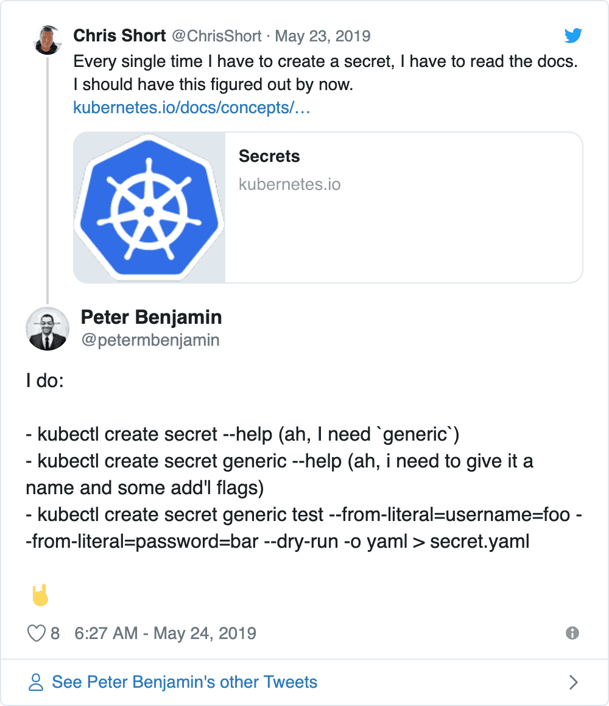

+++
author = "Chris Short"
categories = ["Kubernetes", "2019"]
date = 2019-05-28T11:10:00Z
description = "There are a lot of ways to create a Kubernetes Secret. Let's dive into a few possibilities and some helpful suggestions from the Kubernetes community."
draft = false
ShowTOC = false
slug = "the-secret-to-kubernetes-secrets"
tags = ["kubernetes", "secret", "secrets", "stringdata", "kubectl", "yaml"]
title = "The Secret to Kubernetes Secrets"
[cover]
image = "/the-secret-to-kubernetes-secrets/kubernetes-secrets.png"

+++

I made an innocent [comment on Twitter](https://twitter.com/ChrisShort/status/1131771381438394368) last week that led to WAY more feedback than I was expecting. The Kubernetes community showed me there are a lot of options when creating Kubernetes Secrets. I made the statement:

> Every single time I have to create a secret, I have to read the docs. I should have this figured out by now."

Years ago, a colleague asked Albert Einstein if he knew his phone number. The rebuttal was short and rather Einsteinian, "Never memorize something that you can look up." So when a reminder of how "[Memorization is an anti-pattern.](https://twitter.com/cjimti/status/1132165745389912064)" came up during the conversation about Kubernetes Secrets, I was quite relieved.



The many ways you can peel the Kubernetes Secrets onion seems to grow daily. There are inline secrets, secrets as YAML files, secrets with base64 encoded values, and secrets through third-party providers (like [Hashicorp Vault](https://itnext.io/effective-secrets-with-vault-and-kubernetes-9af5f5c04d06)). When reading the [~~Best~~](https://devopsish.com/128/) Practices for [Kubernetes Secrets](https://kubernetes.io/docs/concepts/configuration/secret/#best-practices), there is a cautionary tale of how things can go wrong.

Several suggestions on how folks managed Kubernetes Secrets themselves rolled in via Twitter. One tip from [Jessica Deen suggested using zsh-autosuggestions](https://twitter.com/jldeen/status/1131984672198713350). This is a very viable option and if you're using ZSH I'd highly recommend it.

My buddy [Todd Edwards suggested using VSCode snippets](https://twitter.com/TriangleTodd/status/1131814890715439106). That is a viable option for most anyone with an IDE. Brian Liles response about [using Shell functions](https://twitter.com/bryanl/status/1132220199330099200) piqued my interest for a different reason (he might have something fancy up his sleeve too). But, this thorough response reads more like a HOWTO and less like a Tweet:

[](https://twitter.com/petermbenjamin/status/1131869227634184198)


One pertinent thing that did come up in discussion was [stringData in Kubernetes Secrets](https://twitter.com/alejandrox135/status/1131890155822952449). Per the documentation, a Secret has:

> "Two maps: data and stringData. The data field is used to store arbitrary data, encoded using base64. The stringData field is provided for convenience, and allows you to provide secret data as unencoded strings."

This means that the now infamous `echo -n "[REDACTED]" | base64` is not needed when `stringData` is used. This  eliminates one command when creating a Kubernetes Secret. I'll be using `stringData` by default in the future. I think `stringData` is relatively new; please don't feel bad for not knowing about it sooner. With this in mind, a YAML file built for use with `kubectl apply` would like this:

```yaml
---
apiVersion: v1
kind: Secret
metadata:
  name: my-special-secret
type: Opaque
stringData:
  key: [REDACTED]
```



In the past, I would keep Secret files in 1Password, Vault, or some other secure storage mechanism. The idea was, I wouldn't have to look at the Kubernetes Secret docs and do it all again. Reducing errors was the idea here. But, no one needs to make a file because they think that's the only way. For simple Secrets, the `--from-literal` flag allows for a key pair after to create a full fledge Secret:

```bash
kubectl create secret generic my-special-secret \
    --from-literal=key0=barf \
    --from-literal=key1=frab
```

When in doubt, run `kubectl describe secret my-special-secret` to verify the secret is at the very least there and has two keys.

```yaml
Name:         my-special-secret
Namespace:    default
Labels:       <none>
Annotations:  <none>

Type:  Opaque

Data
====
key0:  4 bytes
key1:  4 bytes
```

As far Kubernetes Secrets go, there are a few ways to create them. But, I'm going to try to stick to a one-liner or YAML files stored securely and make use of `stringData` for specifying keys and values. Ditching `echo -n "[REDACTED]" | base64` reduces a source of potential confusion and an entire step. This lowers Kubernetes' barrier to entry a smidge, so I am all for that.
