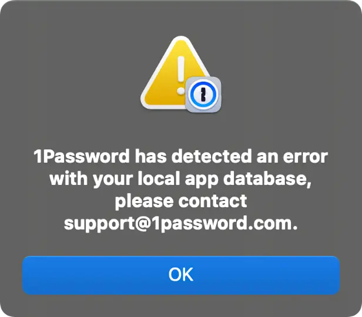



## New MacBook Air 15-inch

I recently decided to buy one of the new 15" MacBook Air M2 models announced at WWDC this year. Nothing was wrong with my M1 MacBook Air aside from the fact that I've always wanted a bigger screen and more RAM. The 15-inch MacBook Air delivers on both fronts with its larger screen. But, only being able to put 24 GB of RAM in the MacBook Air 15-inch shows Apple is scared of a solid Air model cannibalizing the MacBook Pro line. But this blog is about something else.

I went through migrating from one Mac to another with Migration Assistant. The migration was long (I have a lot of data) but very smooth, requiring no intervention until it was ready for the usual setup prompts. Then two problems popped up around licensing, which were easy enough to fix. But, while trying to log in, I discovered 1Password had a blocking issue.

## Error Message

**`1Password has detected an error with your local app database, please contact support@1password.com`**

1Password would not work at all. The error I was getting could have been more helpful too. I immediately had two choices:

1. Contact Support to see if they need specific data or, at the very least, ask for a better error message.
2. Find and destroy all remnants of 1Password, including the database and re-install

I went with #1 in case the error message did need customer support. It turns out I didn't. I sent in a support message and got an auto-reply acknowledging it. Then support responded, asking for a bunch of data I couldn't get because 1Password did not open. Eventually, I got the correct response from them, but I didn't want to wait for Support. I was blocked from logging in to a lot of things.

## Execute Option 2

I did a lot of digging. The error message itself could be more helpful. I could log in online and on my other devices without issue. I figured out where in the bowels of macOS 1Password stored things. This support page led me to my answer: [About 1Password diagnostics information](https://support.1password.com/diagnostics-privacy/#how-1password-stores-and-removes-logs).

The databases are stored on macOS and Windows in these directories:

macOS: `~/Library/Group Containers/2BUA8C4S2C.com.1password/`  
Windows: `%LOCALAPPDATA%\1Password\`

I also found other 1Password and AgileBits directories in the Group Containers directory and deleted those. Support later suggested only deleting the SQLite database within as that is the safer option. I opted for a more nuclear option (I take every opportunity to eliminate cruft).

## Support got back to me after I figured it out

Here is 1Password's Support process documented for posterity:

> You should be able to correct the error message you're seeing by resetting your local 1Password database. This won't impact any of the data already saved to your 1Password account, but will necessitate signing back into the app, so please double check that you're able to sign in on 1Password.com and that **all your data is visible and up to date there**.
>
> Once you've confirmed that all your data is present on the 1Password.com website, you can follow these steps:
>
> 1. Fully quit any browsers that you have open.
> 1. Right-click the 1Password icon in the menu bar (if it's there) and click Quit.
> 1. Open the Finder app
> 1. In menu bar, select Go menu > Go to Folder...
> 1. In the box that appears, copy and paste the following exactly and press Return:
>
> **~/Library/Group Containers/2BUA8C4S2C.com.1password/Library/Application Support/1Password/Data/1password.sqlite**
>
> 1. Right-click on the 1password.sqlite file appears and select Compress "1password.sqlite".
> 1. Drag the original, uncompressed sqlite file to the Trash.
> 1. Wait a few moments and then open 1Password 8.
> 1. Follow the on screen prompts to sign in to your 1Password account.

I got there faster and potentially unsafely, but I was back up and running in 1Password faster than Support could get me actionable data.

## Takeaway

I'm sure Support was overwhelmed by these requests, given new Macs arrived in the US this week. I've always tried to get technical writers to **document all error messages** and what the advanced user can do without opening a ticket to reduce load on Support.

The answer was out there, but the error message did not get me anywhere close. I had to toss that out and go to my system administrator knowledge. The fix was easy for a power user. It should be documented in a support site, thus reducing the load 1Password Support was under this week with everyone migrating machines and getting this message.
