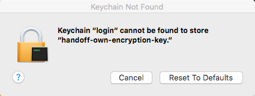
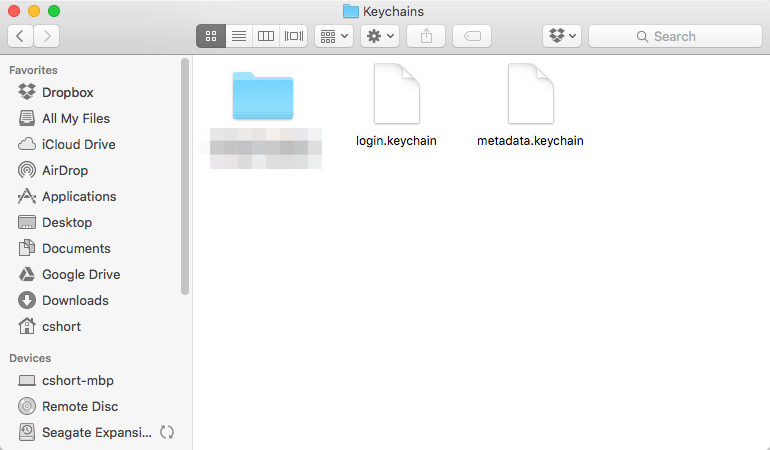



I started having some Apple Keychain issues after upgrading to Mac OS X El Capitan. At random, I would be asked to sign back into accounts that I am logged into through Internet Accounts in System Preferences.

I thought it a minor issue but it became unavoidable though once El Capitan told me it couldn't find my login Apple Keychain after logging in:

Something related to the 'login' Apple Keychain happened during the Mac OS X El Capitan upgrade process I'm assuming and after a reboot this morning everything went to hell in a hand basket it would seem.



I did some searching and found that deleting all the files from ~/Library/Keychains was a workaround (Apple Keychain First Aid was unable to help). I moved them out of the way (moved to Desktop), rebooted, and still had the issue.

I got on the horn with AppleCare. Their resolution was essentially the same. But, they had me completely delete everything in ~/Library/Keychains as Apple Keychain apparently has a way to follow moved keychains (slightly creepy).

After some reboots I'm not getting these annoying "re-sign in" messages. But, I did have to re-sign in to literally everything that was ever signed-in to by me on this Macbook Pro. ~~I should also point out that this seemed to fix issues I was having with the Junos Pulse client not being able to sign in to VPN accounts.~~

**EDIT (10/5/2015 at 1340 ET)**: The resolution to my Junos Pulse issue was short lived. Upon trying to re-connect to a Junos Pulse VPN it literally forces the 'login' keychain to become unusable. Upon reboot everything seems to be working okay. More to follow... Hopefully.

**EDIT (10/7/2015)**: [Mac OS X El Capitan and Junos Pulse](/mac-os-x-el-capitan-and-junos-pulse/) explains what's going on.