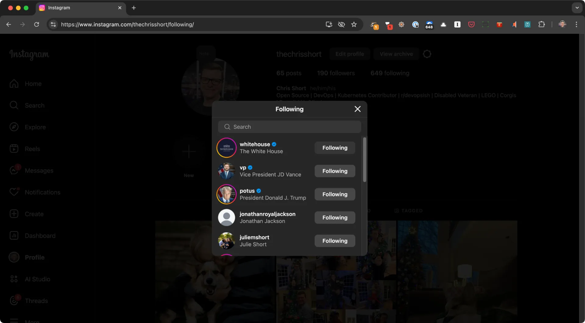

---
aliases:
author: ["Chris Short"]
cover:
  caption: The Social Media Landscape as of early 2025 (not an exhaustive list)
  image: social-media-landscape-2025.webp
  relative: true
title: "Social Media Landscape in 2025"
date: "2025-01-29"
description: "Analysis of social media's evolution in 2025, examining the challenges of centralized platforms and the rise of decentralized alternatives like Mastodon and Bluesky."
summary: "There's some shady stuff happening with centralized social media platforms. The only good places left are decentralized. This a reckoning for traditional social media"
tags:
- Bluesky
- Facebook
- Flickr
- Instagram
- LinkedIn
- Mastodon
- Meta
- Reddit
- Threads
- TikTok
- TikTok ban
- Twitter
- algorithm
- algorithmic
- centralized
- decentralized
- opinion
- social media
- social media landscape
- social network
- social platforms
- 2025
ShowToc: true
TocOpen: true
---

Kaslin Fields and I were talking about the social media landscape in 2025. The Kubernetes Contributor Comms team has been fielding requests to modify our community's social media policies to continue improving the project's vitality. During our discussion, I stated that "**Social media might be coming to the end of its usefulness.**"

From my perspective, social media platforms are changing from helpful tools to straight-up propaganda machines for literally anyone wanting to conduct [information operations](https://en.wikipedia.org/wiki/Information_warfare) (including the CEOs/owners of these platforms) or sway influence.

Nevertheless, some super shady stuff is happening with centralized social media platforms. Let me break things down from my perspective (aka *my opinion*):

## Centralized Platform's Problems are Algorithmic

I believe the real problem with centralized platforms is algorithms that are addictive by design. Yes, they are centralized and controlled by one entity or person, but the algorithms push content our way at the whims of these advertising-powered social media companies.

These same algorithms are easy to manipulate to drive misinformation, to grow one's following, and worse things like hate, dissent, defeating democratic institutions from within, etc. The algorithms are there to get your content interacted with if it will improve the company's bottom line. Some platforms incentivize discontent (especially X, formerly known as Twitter). If you get thrashed every time you post an opinion, that algorithm is working as intended on that network.

### Facebook

Facebook is for connecting to family and folks back home. Meta owns it, and Mark Zuckerberg has decided that information operations on Facebook can and should flourish on Meta's platforms with his axing of most moderation teams at Facebook. I'm not going to subject myself to that. At the same time, I can't completely get rid of it, but I sure as hell can be active only when I choose to be.

### Instagram

Meta also owns Instagram. I have concerns about Meta's use of Instagram photos to train AI, let alone the above-mentioned issues with Zuckerberg. Also, the forced following of accounts I wouldn't typically follow is utterly insane. I want no part in Instagram anymore.

Meanwhile, [**Flickr**](https://www.flickr.com/photos/chris-short/) is still going strong. I have had a Pro account there off and on for a LONG, LONG time. Flickr is my go-to place for picture/graphics sharing.

### Threads

Meta also owns Threads. I posted there for a while, but I never got much engagement. At about the same time, Meta moderation policies changed, so I stopped posting there and deleted my account. To my surprise, Julie has re-homed to Threads after getting off of Twitter, which makes sense for Julie's social media usage, mainly consuming instead of creating it. If that's your typical social media use case, then Threads may be a good place, but that will not last long because of the Meta/Mark Zuckerberg connection.

### X, formerly known as Twitter

Twitter/X is unmoderated and toxic. Elon Musk owns it. If you are willing to [throw up Nazi salutes in public](https://www.theguardian.com/technology/2025/jan/26/elon-musk-far-right-antisemitism), I'm not going to use anything you make. We have a "No Elon" buying philosophy in the Short Household. However, this example continues to reinforce this policy. Besides, most people I followed on X, fka Twitter, have moved to decentralized platforms. My muted words were often not applied to ads, platform growth content, and other practices I'm not fond of. Many of us still have our Twitter accounts because that's where our largest audience is (the Kubernetes community is a part of this group).

### TikTok

TikTok has serious issues here in the US. The federal government employee ban on TikTok is real. I believe the TikTok ban is legitimate after my years in national security. Legitimate concerns are being expressed by the [Five Eyes](https://en.wikipedia.org/wiki/Five_Eyes) and [US intelligence community](https://www.dni.gov/index.php/what-we-do/members-of-the-ic). As the TikTok ban grew closer, I observed Bytedance putting its thumb on the scales to build opposition to the TikTok ban (which worked). The current US administration could easily change its opinion on the ban (I suspect if/when it does, it'll be far broader than only TikTok).

I have YouTube. Between me watching tech and household-related videos and Max watching LEGO Builders and Mr. Beast, we spend plenty of time on that platform. I prefer building a following on YouTube over starting fresh on another video-based social network.

### LinkedIn

LinkedIn is starting to become people's text-based social media outlet of choice (at least for things deemed "professional" enough). There's a penalty if your content links off the site and other algorithm shenanigans. However, LinkedIn has benefited from other networks' mistakes and is becoming people's default choice. I can't blame folks for that; look at the alternatives. LinkedIn could do nothing and pick up more users naturally at this point.

### Reddit

Reddit did its thing with API access to keep its business afloat and drive more ad revenue throughout the platform. Given the relatively high cost of hosting public infrastructure for millions of users, I understand their decision. Having a public API with many apps and users doing all sorts of things is also very expensive.

They are selling data to AI companies as fuel for their Large Language Models (LLMs). Their decision-making about the public API was likely based on monetizing content already being consumed for free (before the change) by OpenAI and others with billions of dollars in funding that Reddit does not have. It's safe to say you can blame generative AI for  Reddit locking down its public API. Nevertheless, I still find and post quality content on Reddit. If you use Reddit, please join the **[DevOps'ish subreddit](https://www.reddit.com/r/devopsish)**!

## Decentralized

Decentralized, non-algorithmic platforms are beginning to pick up significant speed. The increasing adoption rate is because gaming the algorithm isn't possible here because there is no algorithm to game. People see things from their followers chronologically, and ever since 2006, most of us have wanted this to be the default on a particular network. These are the networks I'm spending more of my time on. The networks mentioned are not an exhaustive list, as some social media networks I'm not on or don't know about.

### Mastodon

Mastodon is federated, which is fantastic. The server I'm on does an incredible job moderating and disconnecting from well-known toxic servers. The downside is that it's no longer a concept the masses seem to understand. "What I log in to matters? Why? Aren't they all connected?"

Folks are accustomed to one URL and one login to see everything on that network. When you make them choose one instance/server analysis, paralysis kicks in. But Mastodon is an excellent option because of the federation and, most importantly, the lack of an algorithm. The tech community lives on Bluesky and Mastodon.

### Bluesky

Bluesky utilizes [AT protocol](https://en.wikipedia.org/wiki/AT_Protocol). The AT Protocol is great because people can engage on social media and maintain possession of their content. If you haven't noticed, I'm a big fan of owning your web presence (this website showcases work I've done personally and professionally).

You can also verify yourself through a domain you own without hosting anything yourself (and you don't need to impress a soul to do it). But, while it saw a flood of new users towards the end of 2024, in 2025, that has slowed. Decentralization and owning your presence online might not be novel enough for the masses. The tech community is split between Bluesky and Mastodon. It's leaning toward Bluesky becoming the default, but we're far from that today.

## Muted Words

I use muted words across all social media networks because I don't want to see hate, vitriol, abuse of power, or other unwanted information on a routine basis. I brought these up during Kaslin and I's conversation. I hope it will help others. I put [**my social media muted words**](/micro/social-media-muted-words/) up on my microblog to update them easily.