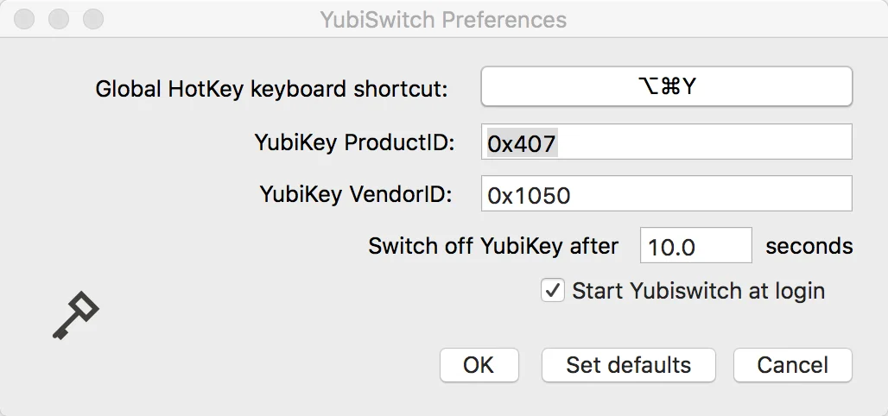

As more and more security policies demand the use of multi-factor authentication the number of times a day you use a multi-factor token will increase. Hopefully that number will not increase to a level that throws the balance of security and convenience towards the annoyingly secure side of the scale. But, if that ever does happen hopefully you can use an [Yubikey](https://www.yubico.com/) as your token.

There are various sizes and styles of Yubikey to suit your need but the Yubikey of choice with myself and my co-workers seems to be the FIDO U2F ready [Yubikey Nano 4](https://www.yubico.com/products/yubikey-hardware/yubikey4/).

The Yubikey Nano 4 inputs the access code into whatever field is in use when it is touched. This is a very convenient option until you realize how often you touch the Yubikey Nano. Think about sitting in a chair with your laptop in your lap and suddenly *vvhttjekbkcvgtnvgjkekjkfvdrvuljndenkrcebhkfh* gets dropped into whatever you're working on. That is where [**yubiswitch**](https://github.com/pallotron/yubiswitch) comes in.

[yubiswitch provides releases](https://github.com/pallotron/yubiswitch/releases/) (source and Mac ready DMG files) for easy installation. But, there is some configuration required after installing yubiswitch.

Install yubiswitch, run it, and open the Yubiswitch Preferences pane:



The YubiKey ProductID in the Preferences field needs to be set correctly or yubiswitch simply won't work. Open a Terminal and run the following command:

`ioreg -p IOUSB -l -w 0 -x | grep Yubikey -A10 | grep Product`

The output will look something like this:

```bash
|     "idProduct" = 0x407
|     "iProduct" = 0x2
|     "USB Product Name" = "Yubikey 4 OTP+U2F+CCID"
```

Plug the value from `idProduct` into the YubiKey ProductID field in the yubiswitch preferences pane, click OK, and yubiswitch should be working. You should now be able to enable and disable the Yubikey with a shortcut key combo or mouse click so you don't get random Yubikey codes dumped into whatever you're working on.
